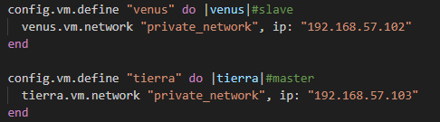

# DNS sistema.test

## 1. Repositorio en GitHub
1. Creamos un repositorio en GitHub para la práctica y realizamos cambios gradualmente. Esto permite tener un historial detallado de los pasos seguidos.
2. Se crea un archivo `.gitignore` para excluir del control de versiones el directorio `.vagrant` y cualquier archivo de respaldo o temporal, manteniendo el repositorio limpio.

## 2. Datos del problema

### 2.1 Red
- Se ha configurado una red privada para todas las máquinas virtuales con la IP `192.168.57.0/24`.  
- Todas las máquinas de la red estarán en este rango de IP para asegurar la conectividad entre ellas.

### 2.2 Equipos
1. Creamos el archivo `Vagrantfile` en el que definimos dos máquinas virtuales:
   - **Tierra** (servidor DNS maestro) con la IP `192.168.57.103`.
   - **Venus** (servidor DNS esclavo) con la IP `192.168.57.102`.
2. Una vez creado el archivo `Vagrantfile`, iniciamos las máquinas y establecemos una red privada entre ellas.
3. Usamos SSH para acceder a la máquina **Tierra** y configuramos los archivos necesarios para el servidor DNS maestro.
   
   

## 3. Datos del DNS

1. **Instalación del servidor DNS (BIND)**:
   - En el `Vagrantfile`, hemos incluido un script `shell` para instalar BIND automáticamente en ambas máquinas.

2. **Configuración del servidor DNS Maestro (Tierra)**:
   - En la máquina **Tierra**, copiamos los archivos de configuración DNS a la carpeta `/etc/bind`.
   - Configuramos los siguientes archivos:
     - `named.conf.options`: Configuramos las opciones de servidor, activamos la validación `dnssec` y añadimos los `forwarders`.
     - `named.conf.local`: Configuramos la autoridad del servidor sobre la zona directa e inversa para el dominio `sistema.test`.
     - `db.sistema.test`: Creamos la base de datos directa.
     - `db.192.168.57`: Creamos la base de datos inversa.

3. **Configuración del servidor DNS Esclavo (Venus)**:
   - En la máquina **Venus**, copiamos el archivo `named.conf.local` desde la máquina maestro.
   - Configuramos el archivo para que **Venus** actúe como esclavo de **Tierra** para la zona directa e inversa del dominio `sistema.test`.

4. **Configuración de caché y opciones adicionales**:
   - En la máquina **Tierra**, configuramos el caché del DNS y el archivo `named.conf.options` para aceptar consultas solo desde las redes `127.0.0.0/8` y `192.168.57.0/24`.
   - Establecemos el reenviador de consultas DNS no autorizadas hacia el servidor DNS de OpenDNS (`208.67.222.222`).
